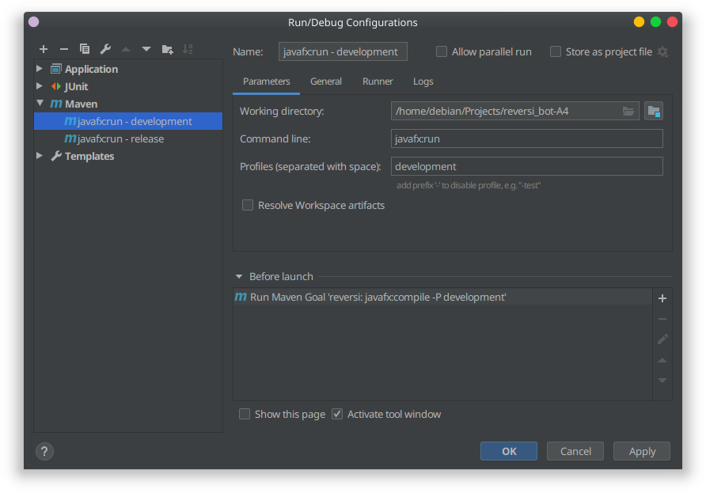

# Reversi Bot

A simple app to play othello and tick tack toe made by 
https://github.com/verluci
https://github.com/lutzenh

## Building

If you want to build without creating a runnable `jar`-file go to the section `Building (without packaging)`, if you want to create a runnable `.jar`-file go to `Building (with packaging)`

### Building (without packaging)

clone this repo using https or ssh:

```
git clone https://github.com/verluci/reversi_bot-A4.git
```

Build the project using maven (using your favorite IDE), I suggest adding a run configuration to your IDE using the following maven commands:

```
mvn javafx:compile -P development
mvn javafx:run -P development
```

This might look like this in your IDE:



### Building (with packaging)

clone this repo using https or ssh:

```
git clone https://github.com/verluci/reversi_bot-A4.git
```

To package the project as a .jar perform the following maven command:

> this can also be done inside of your IDE

```
mvn package -P release
```

## Running

### Running on Linux (debian based)

The run the packaged `.jar` you first need to install some dependencies:

> default-jre should be jre 11 or higher

```
sudo apt install default-jre
```

Optional dependencies to install are the OpenCL libraries for performing GPU accelerated computations:

```
sudo apt install opencl-icd
sudo apt install ocl-icd-opencl-dev
```

> opencl-icd is a virtual package, you have to choose the right package depending on your GPU. The mesa drivers should work for most AMD GPU's. If you have an NVIDIA GPU use one of the nvidia opencl libraries or if you have an Intel GPU use the beignet library.

To run the `.jar` either launch it using your file-manager or go to the location of the `.jar` in your terminal and run the following command:

```
java -jar reversi-1.0-SNAPSHOT.jar
```

### Running on Windows

Make sure you have java version 11 or higher installed. This can be checked using the following command in CMD:

```
java -version
```

The output should show something like this where the `11` shows the current java version you are using:

```
openjdk version "11.0.6" 2020-01-14
OpenJDK Runtime Environment
OpenJDK 64-Bit Server VM
```

The optional OpenCL libraries should be shipped with your GPU drivers on Windows, if not try downloading the newest GPU drivers from the website of your gpu-vendor.

To run the `.jar` either launch it using Windows file-manager or go to the location of the `.jar` in your cmd and run the following command:

```
java -jar reversi-1.0-SNAPSHOT.jar
```

## Usage

If you want to play against other players in a tournament use the headless packaged `.jar`-file as followed:

```
> java -jar reversi-1.0-SNAPSHOT-headless.jar -u USERNAME -h HOSTNAME -p PORT -t N_THREADS

usage:
 -gpu,--gpu <arg>      The device-index of the CL-device that is going to
                       be performing the simulations.
 -h,--hostname <arg>   The host-name or ip-address of the server.
 -p,--port <arg>       The port of the server.
 -t,--threads <arg>    The base amount of threads * 1024 this GPU is going
                       to use. The maximum amount of threads that are
                       going to be used is threads * 2048.
 -u,--username <arg>   The player's username on the server.
```

If you want to play against the AI with a UI locally launch the non-headless variant using:

> Make sure a game-server is running and you have configured the hostname and port correctly. If you want to play against the MCTS-GPU AI make sure to choose your graphics device in *Instellingen*

```
java -jar reversi-1.0-SNAPSHOT.jar
```


